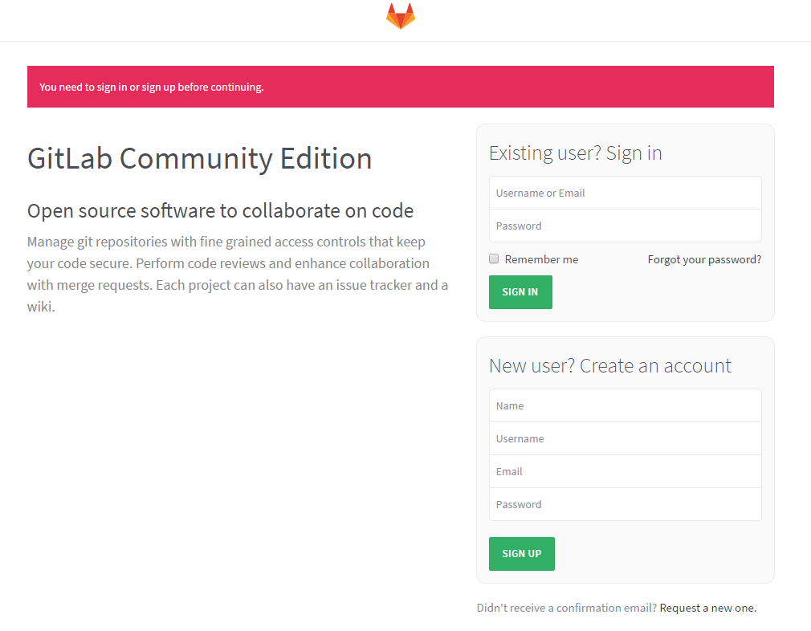

== 进阶

[quote]
____
本节我们以运行`Gitlab`实例为例，进一步介绍Docker的常规使用。
____

TIP: 上节`MySQL`是独立的镜像，没有依赖，但`Gitlab`会依赖数据库及缓存，我们看看容器间如何交互。`Gitlab`有官方镜像，但我更喜欢`sameersbn`的版本，这个版本介绍详细，并且作者一直在持续更新。

=== 获取Redis镜像并运行

[source,bash]
----
root@ubuntu:~# docker pull redis
...
root@ubuntu:~# docker run --name gitlab-cache -d redis
a2c183f16cee0aa30eca8f27875d3770ac1291fc22b218d4b5e673ce604074c8
----

=== 获取MySQL镜像并运行

[source,bash]
----
root@ubuntu:~# mkdir -p /opt/test/gitlab/db/ <1>
root@ubuntu:~# docker pull mysql
...
root@ubuntu:~# docker run --name gitlab-db -e MYSQL_ROOT_PASSWORD=123456 -d -p 3307:3306 -v /opt/test/gitlab/db:/var/lib/mysql mysql:5.7
7c8110b8151e2ddbc67d2bb1d96a9cc24ef68546a885d065e78bd274775ec7f7
----
<1> 创建数据库目录映射

=== 创建相应的数据库及权限

[source,bash]
----
root@ubuntu:~# docker exec -it gitlab-db /bin/bash
root@7c8110b8151e:/# mysql -uroot -p123456
mysql: [Warning] Using a password on the command line interface can be insecure.
Welcome to the MySQL monitor.  Commands end with ; or \g.
Your MySQL connection id is 4
Server version: 5.7.9 MySQL Community Server (GPL)

Copyright (c) 2000, 2015, Oracle and/or its affiliates. All rights reserved.

Oracle is a registered trademark of Oracle Corporation and/or its
affiliates. Other names may be trademarks of their respective
owners.

Type 'help;' or '\h' for help. Type '\c' to clear the current input statement.

mysql> CREATE USER 'gitlab'@'%.%.%.%' IDENTIFIED BY 'password';
Query OK, 0 rows affected (0.00 sec)

mysql> CREATE DATABASE IF NOT EXISTS `gitlabhq_production` DEFAULT CHARACTER SET `utf8` COLLATE `utf8_unicode_ci`;
Query OK, 1 row affected (0.00 sec)

mysql> GRANT ALL PRIVILEGES ON `gitlabhq_production`.* TO 'gitlab'@'%.%.%.%';
Query OK, 0 rows affected (0.00 sec)

mysql> exit
Bye
root@7c8110b8151e:/# exit
exit
----

TIP: `exec` (((docker exec))) 表示进入一个运行中的容器

NOTE: MySQL中执行的语句见： https://hub.docker.com/r/sameersbn/gitlab/#external-mysql-server

=== 获取Gitlab镜像

[source,bash]
----
root@ubuntu:~# mkdir -p /opt/test/gitlab/data <1>
root@ubuntu:~# docker pull sameersbn/gitlab
----
<1> 创建GIT数据目录映射

=== 运行Gitlab镜像(((docker run))) 

[source,bash]
----
root@ubuntu:~# docker run --name=gitlab -d \
 -e GITLAB_PORT=10080 \ <1>
 -e GITLAB_SSH_PORT=10022 \ <2>
 -e GITLAB_HOST=inner.ecfront.com \ <3>
 -e DB_TYPE=mysql \ <4>
 -e DB_HOST=192.168.4.99 \
 -e DB_PORT=3307 \
 -e DB_NAME=gitlabhq_production \
 -e DB_USER=gitlab \
 -e DB_PASS=password \
 -e GITLAB_EMAIL=git@ecfront.com \ <5>
 -e SMTP_ENABLED=true \
 -e SMTP_DOMAIN=ecfront.com \
 -e SMTP_HOST=smtp.exmail.qq.com \
 -e SMTP_PORT=25 \
 -e SMTP_USER=git@ecfront.com \
 -e SMTP_PASS=xxx \
 -e SMTP_AUTHENTICATION=login \
 -e NGINX_MAX_UPLOAD_SIZE=512m \ <6>
 -e GITLAB_BACKUPS=monthly \ <7>
 -p 10022:22 \ <8>
 -p 10080:80 \ <9>
 -v /opt/test/gitlab/data:/home/git/data \ <10> 
 --link gitlab-cache:redisio \ <11>
 --dns=192.168.4.99 \ <12>
 sameersbn/gitlab
----
<1> HTTP服务端口
<2> SSH请求端口
<3> 服务域名
<4> 数据库连接信息
<5> Email信息
<6> 解决`RPC failed; result=22, HTTP code = 413`问题，见 http://stackoverflow.com/questions/7489813/github-push-error-rpc-failed-result-22-http-code-413
<7> 备份策略，每天
<8> SSH请求端口映射
<9> HTTP请求端口映射
<10> GIT数据目录映射
<11> 连接Reids容器，实现缓存
<12> 配置DNS

IMPORTANT: 如果使用MySQL数据库一定要加上`-e DB_TYPE=mysql`否则这个容器会以默认的Postgre类型去连接导致无法启动

TIP: `--dns` 用于指定容器的DNS，我们可以指定一个公共DNS以实现不同容器互PING

TIP: Docker默认情况下容器间是不能互访的，要实现交互主要有两种途径，一是用`--link`这也是Docker推荐的做法，它会在容器中建立被Link容器的Host记录实现单向访问，另一种是开放服务实现调用，对于上述案例，Redis使用的是Link方式，MySQL使用是开放服务方式。

* 访问一下：`http://192.168.4.99:10080` (192.168.4.99是我宿主机的IP)，等等，为什么访问不了？

=== 查看运行日志

* 在出问题时我们首先想到的是 **去看看日志** (((docker logs))),Docker容器运行日志的查看如下：

[source,bash]
----
root@ubuntu:~# docker logs gitlab
ERROR: 
  Please configure the GITLAB_SECRETS_DB_KEY_BASE parameter.
  Cannot continue. Aborting...
----
提示是需要`GITLAB_SECRETS_DB_KEY_BASE`变量，查看官方说明：
[quote,https://hub.docker.com/r/sameersbn/gitlab/]
____
**Note**: Since GitLab ``8.0.0`` you need to provide the ``GITLAB_SECRETS_DB_KEY_BASE`` parameter while starting the image.

**Tip**: You can generate a random string using `pwgen -Bsv1 64` and assign it as the value of``GITLAB_SECRETS_DB_KEY_BASE``.
____

* 好的，我们用`pwgen -Bsv1 64`生成一个密钥
[source,bash]
----
root@ubuntu:~# pwgen -Bsv1 64
7hpTqCXgf4tVbnFmdC7PNn9n4hWmCnvF479fsJtcdTkhmVfWfzpwTJ4sNRzNkkXf
----

* 把`GITLAB_SECRETS_DB_KEY_BASE`加上重新运行
[source,bash]
----
root@ubuntu:~# docker rm -f gitlab
root@ubuntu:~# docker run --name=gitlab -d \
 -e GITLAB_PORT=10080 \
 -e GITLAB_SSH_PORT=10022 \
 -e GITLAB_HOST=inner.ecfront.com \
 -e DB_TYPE=mysql \
 -e DB_HOST=192.168.4.99 \
 -e DB_PORT=3307 \
 -e DB_NAME=gitlabhq_production \
 -e DB_USER=gitlab \
 -e DB_PASS=password \
 -e GITLAB_SECRETS_DB_KEY_BASE=7hpTqCXgf4tVbnFmdC7PNn9n4hWmCnvF479fsJtcdTkhmVfWfzpwTJ4sNRzNkkXf \
 -e GITLAB_EMAIL=git@ecfront.com \
 -e SMTP_ENABLED=true \
 -e SMTP_DOMAIN=ecfront.com \
 -e SMTP_HOST=smtp.exmail.qq.com \
 -e SMTP_PORT=25 \
 -e SMTP_USER=git@ecfront.com \
 -e SMTP_PASS=xxx \
 -e SMTP_AUTHENTICATION=login \
 -e NGINX_MAX_UPLOAD_SIZE=512m \
 -e GITLAB_BACKUPS=monthly \
 -p 10022:22 \
 -p 10080:80 \
 -v /opt/test/gitlab/data:/home/git/data \
 --link gitlab-cache:redisio \
 --dns=192.168.4.99 \
 sameersbn/gitlab
----

=== 完成

* 好了，第一次要做的事情比较多，过一会就可以打开页面了

IMPORTANT: 用户名：root 密码：5iveL!fe

