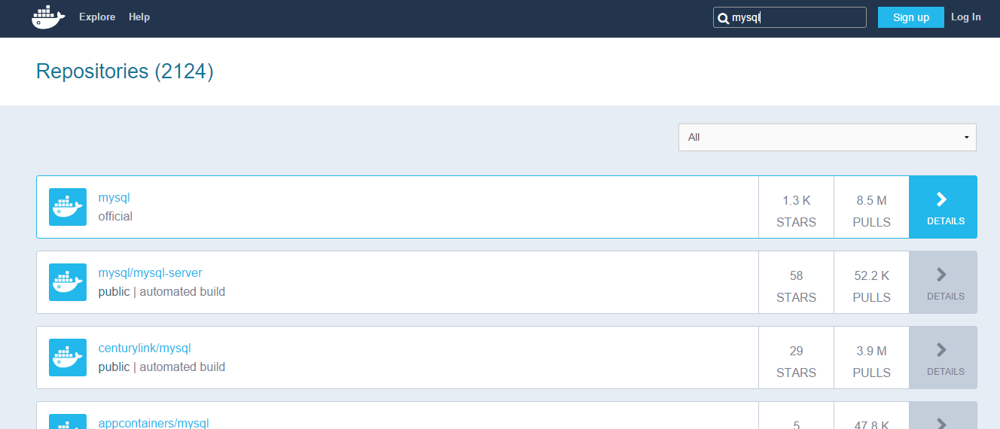
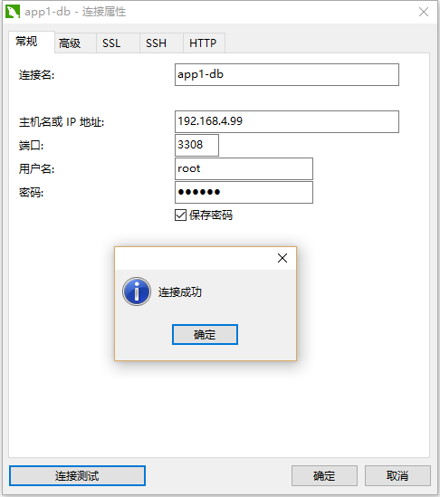

== 基础

[quote]
____
本节我们以运行`MySQL`实例为例，介绍基础使用。
____

TIP: 使用 `docker --help` 查看支持的所有命令

=== 获取MySQL镜像

* 首先我们从`hub.docker.com`上获取`MySQL`镜像

这里有两种方式，一是使用 (((docker search))) `search`命令：
[source,bash]
----
root@ubuntu:~# docker search mysql
NAME                       DESCRIPTION                                     STARS     OFFICIAL   AUTOMATED
mysql                      MySQL is a widely used, open-source relati...   1253      [OK]       
mariadb                    MariaDB is a community-developed fork of M...   280       [OK]       
mysql/mysql-server         Optimized MySQL Server Docker images. Crea...   58                   [OK]
centurylink/mysql          Image containing mysql. Optimized to be li...   29                   [OK]
...
----

另外我们也可以在网页上查询更详细的说明：

TIP: `STARS` 表示收藏的数量，`PULLS`表示下载的数量，`OFFICIAL`表示是官方镜像（此处表示是否是MySQL官方发布）

* 我们下载第一个官方的镜像 (((docker pull))) 

[source,bash]
----
root@ubuntu:~# docker pull mysql
Pulling repository mysql
196db1908492: Download complete 
575489a51992: Download complete 
...
Status: Downloaded newer image for mysql:latest
----

TIP: Docker镜像的命名格式 `<用户名，官方镜像不需要/>镜像名称</版本号>` 

=== 查看本机镜像

* 查看本机的所有镜像 (((docker images))) 

[source,bash]
----
root@ubuntu:~# docker images
REPOSITORY             TAG                 IMAGE ID            CREATED             VIRTUAL SIZE
mysql                  5.7                 196db1908492        6 days ago          359.8 MB
mysql                  5.7.9               196db1908492        6 days ago          359.8 MB
mysql                  latest              196db1908492        6 days ago          359.8 MB
...
----

=== 运行MySQL镜像

* 运行`MySQL`镜像 (((docker run))) 

[source,bash]
----
root@ubuntu:~# docker run --name app1-db -e MYSQL_ROOT_PASSWORD=123456 -d mysql:5.7
2dee953f85d697ffcb78ac795f06e1a22731ae373b154178ea6220ce9b9c6e04
----

TIP: `--name` 指定容器名称，`-e` 指定特殊的一些变量，`-d` 表示后台运行（服务化）

=== 查看本机容器

* 查看本机的所有在运行容器 (((docker ps))) 

[source,bash]
----
root@ubuntu:~# docker ps
CONTAINER ID        IMAGE      COMMAND                CREATED             STATUS        PORTS     NAMES
2dee953f85d6        mysql:5    "/entrypoint.sh mysq   6 seconds ago       Up 5 seconds  3306/tcp  app1-db 
----

TIP: `docker ps -a`  (((docker ps))) 可以查看所有容器（包含没有运行的）

* 然后呢，怎么连接？我们需要一个IP和端口，但上面的运行并没有对外暴露端口，所以我们要重新运行一个容器

WARNING: Docker目前（v1.7）还不支持为容器绑定端口，如有此需求请查看<<qanda-add-port-to-alive-container,如何为运行中的容器增加访问端口>> 

=== 删除MySQL容器

* 我们先删除刚才的容器(((docker rm))) 

[source,bash]
----
root@ubuntu:~# docker rm -f app1-db
app1-db
----

TIP: `-f` 表示强制删除运行中的容器

CAUTION: 这会删除容器中的所有数据。不科学呀？那我想删除容器时保留某些数据（如这里的数据库文件）怎么办？我们往下看：

* 重新运行`MySQL`镜像

[source,bash]
----
root@ubuntu:~# docker run --name app1-db -e MYSQL_ROOT_PASSWORD=123456 -d -p 3308:3306 -v /opt/mysql_data:/var/lib/mysql mysql:5.7
1add96f289a1b8744500a4a6709af6e2e0628b97797e8470be75efe67e2005f4
----

TIP: `-p`表示将外部访问的3308端口映射到容器的3306端口，由于`MySQL`镜像默认允许对外开放3306端口（我为什么知道？看它的`dockerfile`，后面会有说明），所以也可以直接用`-P`,这样的话外部访问3306也被映射到容器的3306端口上

IMPORTANT: `-v`参数可以宿主机的目录映射到将容器内目录，上例`-v /opt/mysql_data:/var/lib/mysql`会将宿主机`/opt/mysql_data`映射到容器`/var/lib/mysql`(已知此目录为MySQL的数据目录)，这样可以保证容器删除时对应目录的数据不被删除（因为这个目录是宿主机上的），这点很重要，实际使用中几乎所有容器都要做此映射！

* 有了端口之后那IP呢？IP实际上就是你docker宿主机的IP

NOTE: Docker的访问机制简单说明：Docker所有的对外服务统一使用`宿主机IP+特定端口`，当一个请求发起时会经由宿主面的iptables根据容器创建时的端口规则转发到对应的容器处理。

* 好了，现在我们做个连接测试，通过

=== 停止/运行/重启MySQL容器

* 当然我们也可以对容器做`停止/运行/重启`(((docker stop)))  (((docker start))) (((docker restart)))操作：

[source,bash]
----
root@ubuntu:~# docker stop app1-db 
app1-db
root@ubuntu:~# docker start app1-db 
app1-db
root@ubuntu:~# docker restart app1-db 
app1-db
----

=== 完成

`MySQL`容器如何升级/数据如何备份都方式都可以在 `https://hub.docker.com/_/mysql/` 获取到指导。

至此，我们基础使用就介绍完了！