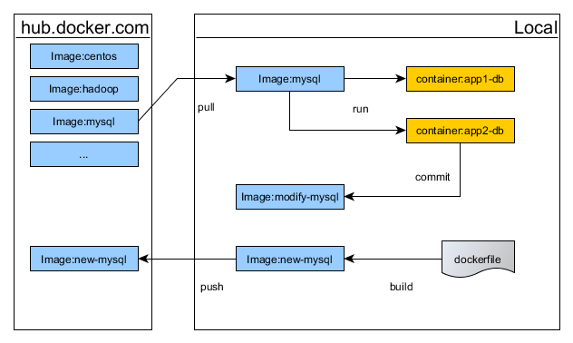

== 核心概念

在正式使用Docker前我们先简述几个核心概念。

*Image（镜像）*

与我们熟知的`Windows`镜像（ISO或安装光盘）类似，可以理解为一份特定应用的Copy，它是只读的。

*Container（容器）*

镜像是不能直接运行的，只有安装后才能使用，容器就是这个运行镜像后的实例，我们可以修改实例。

*Dockerfile*

用于制作镜像的元文件，有点类似`Maven`的`pom.xml`文件，可以通过它构建一个镜像。

*hub.docker.com*

镜像发布共享的地方，与`search.maven.org`类似。

它们之间的关系如下：

.关系

