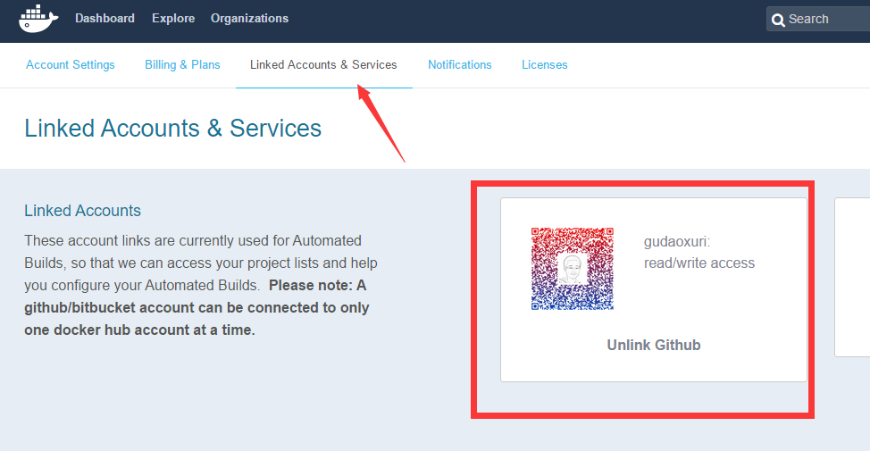
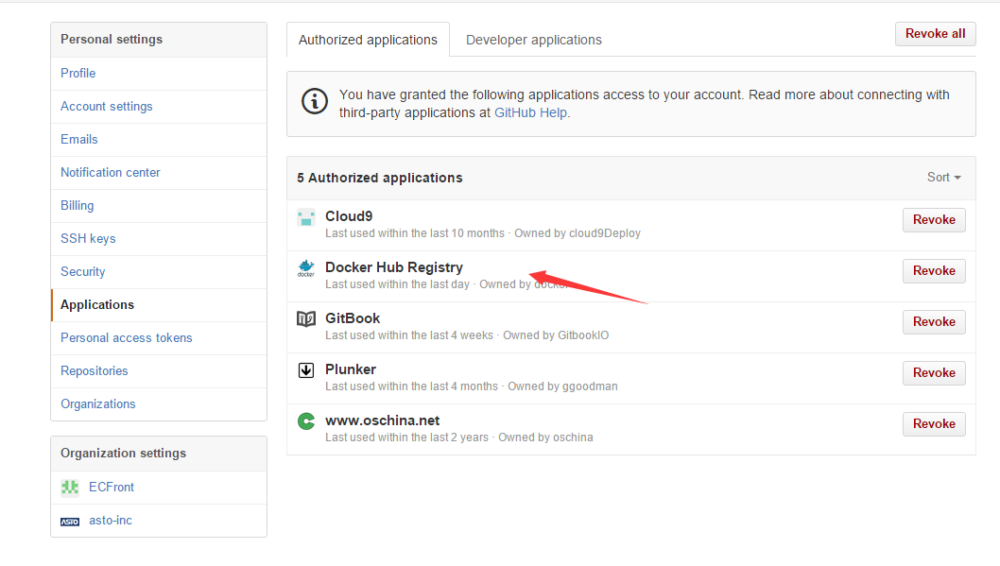
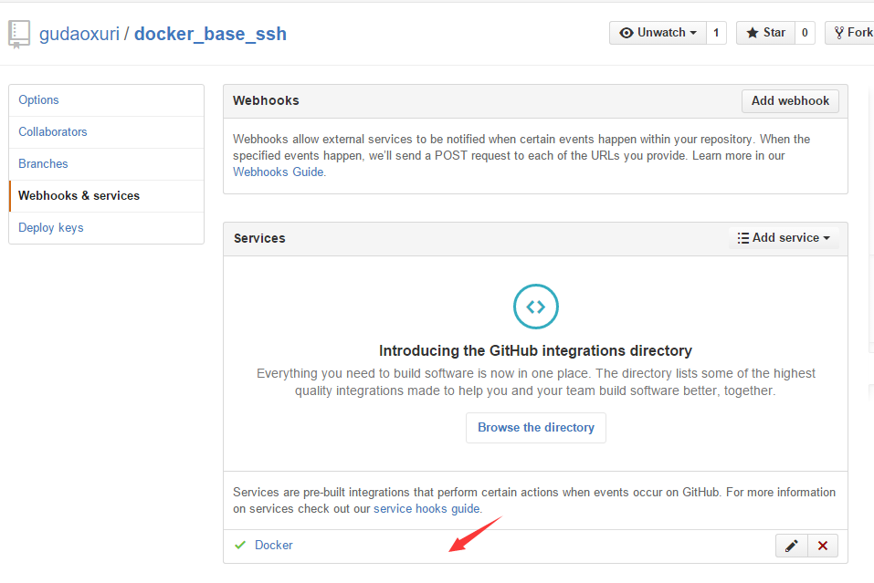
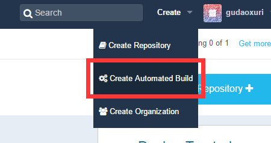
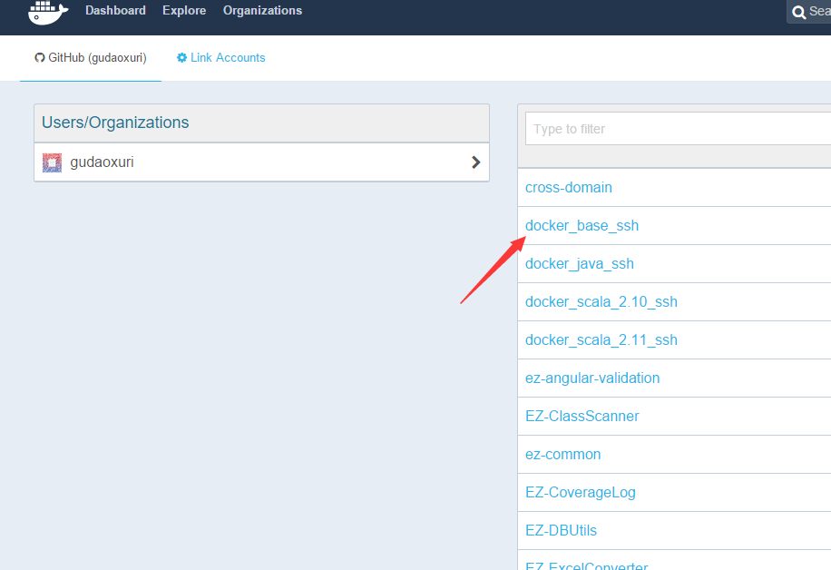
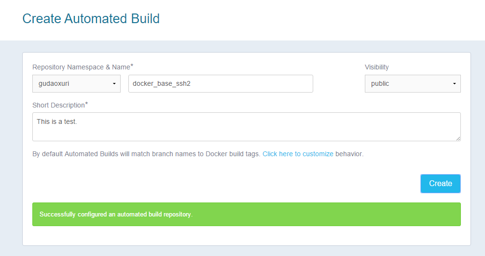
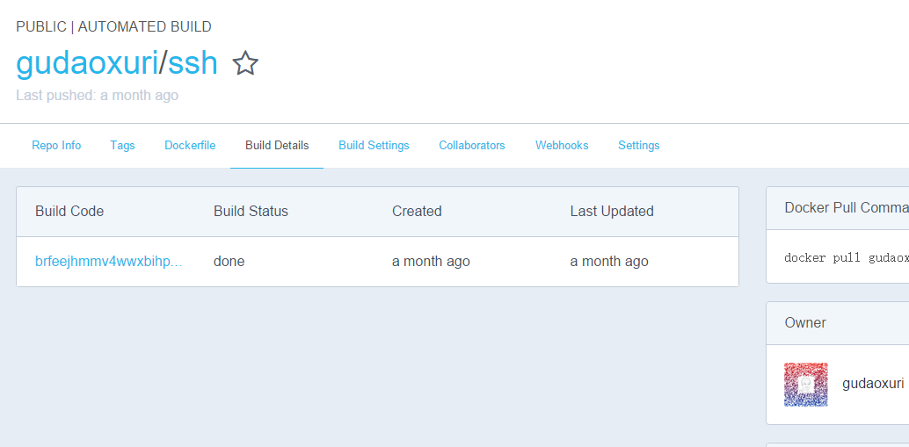

== 高级

[quote]
____
本节我介绍如何自己构建一个Docker镜像，我们将构建一个支持scala的运行（ http://www.scala-lang.org ）环境，并且对外开放SSH服务。
____

=== 构建镜像的两种方法

构建镜像有两种方法：

. 运行并进行一个基础容器（如centos ， `docker run -it centos /bin/bash`），然后安装需要的环境，再用`commit` (((docker commit))) 将容器保存成新的镜像
. 使用`Dockerfile`构建，这也是推荐的做法

本节我们仅介绍第2种方法。

=== Dockerfile介绍

Dokcerfile是用于构建Docker镜像的元文件，它的说明及语法见： http://docs.docker.com/engine/reference/builder/

=== 构建规划

根据需求可以发现我们安装的主要环境有三个：SSH服务、Java环境（Scala依赖它）、Scala环境，与软件开发一样，我们也可以`分模块`构建，即构建三个镜像：

. 只包含SSH服务的基础镜像
. 带SSH及Java环境的镜像
. 带SSH、Java及Scala环境的镜像

=== SSH镜像

[source,script]
----
FROM centos:centos7 <1>
MAINTAINER gudaoxuri <2>

#---------------Use 163 mirrors--------------- <3>
RUN yum install -y wget &&\
    mv /etc/yum.repos.d/CentOS-Base.repo /etc/yum.repos.d/CentOS-Base.repo.backup && \
    wget -P /etc/yum.repos.d/ http://mirrors.163.com/.help/CentOS7-Base-163.repo && \
    yum clean all && \
    yum makecache <4>

#---------------Install Common Tools---------------
RUN yum install -y sed curl tar gcc gcc-c++ make git passwd sudo

#---------------Modify Time Zone---------------
ENV TZ "Asia/Shanghai" <5>
ENV TERM xterm

RUN yum install -y ntpdate  && \
    cp /usr/share/zoneinfo/Asia/Shanghai /etc/localtime

#---------------Support Chinese---------------
#RUN yum groupinstall -y "Fonts"  && \
#    echo "LANG=\"zh_CN.UTF-8\"" >> /etc/sysconfig/i18n

#---------------Install SSH---------------
RUN yum install -y openssh-server openssh-clients  && \
    sed -i 's/UsePAM yes/UsePAM no/g' /etc/ssh/sshd_config  && \
    echo 'root:123456' | chpasswd  && \
    ssh-keygen -t dsa -f /etc/ssh/ssh_host_dsa_key  && \
    ssh-keygen -t rsa -f /etc/ssh/ssh_host_rsa_key  && \
    mkdir /var/run/sshd

#---------------Setting Common Path---------------
RUN chmod 777 -R /opt/  && \
    mkdir /opt/env/  && \
    mkdir /opt/workspaces/

EXPOSE 22 <6>

CMD ["/usr/sbin/sshd", "-D"] <7>
----
<1> (((dockerfile FROM))) `FROM` 表示此镜像是基于哪个镜像构建的
<2> (((dockerfile MAINTAINER))) `MAINTAINER` 开发者的信息
<3> (((dockerfile #)))  # 注释
<4> (((dockerfile RUN))) `RUN` 常用命令，用于执行Linux的命令，多用于安装组件
<5> (((dockerfile ENV))) `ENV` 常用命令，用于设置环境变量
<6> (((dockerfile EXPOSE))) `EXPOSE` 表明默认对外暴露的端口(`docker run -P`)
<7> (((dockerfile CMD))) `CMD` 要执行的服务，多条`CMD`只执行最后一条

TIP: `RUN` 参数的学问，Docker镜像是分层的，一个镜像可能由多个层组成，一次`RUN`实际上就产生了一层，在编译`Dockerfile`的过程中可能出错，重新编译时我们会发现之前已成功编译的层不会再次被编译

=== 编译SSH镜像

[source,bash]
----
root@ubuntu:/opt/test/dockerfile/ssh# ls
Dockerfile
root@ubuntu:/opt/test/dockerfile/ssh# docker build -t gudaoxuri/ssh .
Sending build context to Docker daemon 3.072 kB
Sending build context to Docker daemon 
Step 0 : FROM centos:centos7
Pulling repository centos
ce20c473cd8a: Download complete 
ce20c473cd8a: Pulling image (centos7) from centos 
168a69b62202: Download complete 
812e9d9d677f: Download complete 
4234bfdd88f8: Download complete 
Status: Downloaded newer image for centos:centos7
 ---> ce20c473cd8a
Step 1 : MAINTAINER gudaoxuri
 ---> Running in 889ea744c458
 ---> 5b1151e6cb0b
Removing intermediate container 889ea744c458

...

Step 10 : CMD /usr/sbin/sshd -D
 ---> Running in ce563073b686
 ---> b61a4adad85f
Removing intermediate container ce563073b686
Successfully built b61a4adad85f

root@ubuntu:/opt/test/dockerfile/ssh# docker images
REPOSITORY             TAG                 IMAGE ID            CREATED             VIRTUAL SIZE
gudaoxuri/ssh          latest              b61a4adad85f        10 minutes ago      966 MB
...

----

=== Java镜像
[source,script]
----
FROM gudaoxuri/ssh:latest <1>
MAINTAINER gudaoxuri

#---------------Install Java---------------
RUN wget -P /opt/env/ --no-check-certificate --no-cookies --header "Cookie: oraclelicense=accept-securebackup-cookie"  http://download.oracle.com/otn-pub/java/jdk/8u60-b27/jdk-8u60-linux-x64.tar.gz  && \
    tar -xzf /opt/env/jdk-8u60-linux-x64.tar.gz -C /opt/env/  && \
    rm /opt/env/jdk-8u60-linux-x64.tar.gz  && \
    mv /opt/env/jdk1.8.0_60 /opt/env/java  && \
    echo "export JAVA_HOME=/opt/env/java" >> /etc/profile
ENV  JAVA_HOME /opt/env/java

RUN echo 'PATH=$PATH:$JAVA_HOME/bin' >> /etc/profile
ENV PATH $PATH:$JAVA_HOME/bin
----
<1> `gudaoxuri/ssh:latest` 就是我们之前编译的镜像

=== Scala镜像
[source,script]
----
FROM gudaoxuri/java:latest
MAINTAINER gudaoxuri

#---------------Install Scala---------------
RUN wget -P /opt/env/ http://downloads.typesafe.com/scala/2.10.6/scala-2.10.6.tgz  && \
    tar -xzf /opt/env/scala-2.10.6.tgz -C /opt/env/  && \
    rm /opt/env/scala-2.10.6.tgz  && \
    mv /opt/env/scala-2.10.6 /opt/env/scala  && \
    echo "export SCALA_HOME=/opt/env/scala" >> /etc/profile
ENV SCALA_HOME /opt/env/scala

RUN sed /^PATH=/d /etc/profile >> /etc/profile && \
   echo 'PATH=$PATH:$JAVA_HOME/bin:$SCALA_HOME/bin' >> /etc/profile
ENV PATH $PATH:$JAVA_HOME/bin:$SCALA_HOME/bin
----

=== 编译Java/Scala镜像

过程同上，略

=== 发布镜像

有了新的镜像后我们希望把这个镜像发布到`hub.docker.com`上去分享，有两种方式：

. 使用(((docker push))) `docker push` 发布前要先登录 (((docker login))) `docker login`
. 使用`github`发布

TIP: 介于国内网络环境恶劣，第1种方式失败概率很高，因为它上传的是生成的镜像（几百MB到几G不等），所以推荐使用第2种方式

NOTE: 请先注册`hub.docker.com` 及 `github.com` 的账号

==== 使用github发布镜像

IMPORTANT: 不要用`IE`操作，笔者使用`IE11`在`hub.docker.com`上操作时发生过不小的困扰。

* 在`hub.docker.com` 上建立`github`连接

* 在`github`中设置权限

* 在`github`中建一个开源项目，注意要包含`Dockerfile`文件

image::images/deep_publish_create_git.png[]

* 在`github`中设置这个项目的权限

* 在`hub.docker.com` 上建立自动构建项目

* 在`hub.docker.com` 上选择`github`上的项目

* 在`hub.docker.com` 上设置项目属性

* 不多时就构建好了

TIP: 更详细的说明见： https://docs.docker.com/docker-hub/github/

